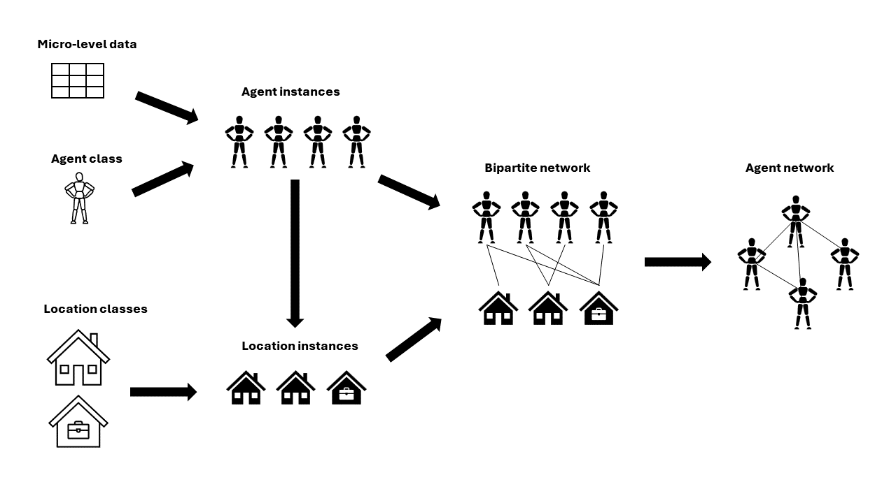

=============
About Pop2net
=============

Interactions between agents are the key elements of agent-based models.
Thus, the interaction structure in such models must be implemented with care.
When appropriate empirical network data are unavailable, which is often the case, simulation models must rely on network models.
However, in many cases, the classic network models (for instance, random networks, small world networks, etc.) are too abstract to create valid interaction structures.
Existing network generators can be a solution, but they often are domain-specific or do not offer enough control over the network generation.
To fill the gap between often unavailable network data and too abstract network models, we introduce the Python package Pop2net.

Pop2net offers a new way to quickly create detailed network models that can be used for agent-based simulations.
In Pop2net, you create networks by formulating rules for which agents come together in which context and in which way.
For this, Pop2net relies on the concept of contact layers. 
Contact layers act as virtual locations where agents meet.
Pop2net provides a simple syntax to define, for instance, who gets assigned to a certain location and how edges are formed within a location.
Creating networks using contact layers is not new, but is already known from epidemiological agent-based models, for example.
However, Pop2net is the first software package that makes this approach of network generation usable in a general and domain-unspecific framework.

The main output of Pop2net is a bipartite network: a population of agents linked through contact layers.
This linked population can be used directly in an agent-based model (Mesa, AgentPy, etc.) or exported in networkX format, for instance.
Pop2net also makes it possible to create the population of agents from empirical individual data easily.
This allows the user to tie the desired properties of the network structure to empirical agent attributes.

The following figure provides an overview of the workflow to generate networks using Pop2net:

