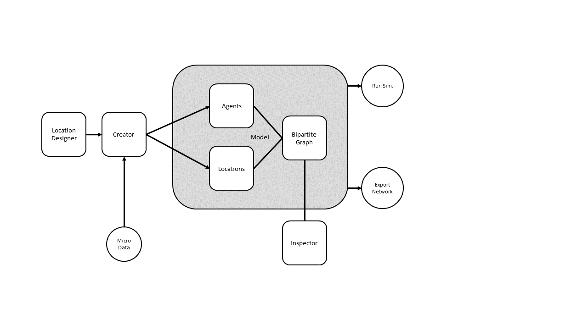

# Introduction
Agent-based modeling is a scientific method used in fields such as social sciences, biology, and ecology to simulate the interactions of autonomous agents and examine the resulting emergent phenomena (CITE?). 
Relationships between agents, which structure the simulated interactions, are often represented by network graphs. 
Since empirical data on networks is rare, the majority of agent-based models rely on artificially generated networks [@amblard_which_2015].
Consequently, generating a valid network structure at the beginning of a simulation, as well as accessing and modifying it during the simulation, are critical steps that must be managed in almost every agent-based model.

Pop2net is a Python package which bundles all steps related to network generation and management for agent-base modeling.
In Pop2net, relationships between agents are represented through a bipartite graph of agents and locations.
Locations act as contact layers, representing specific contexts through which agents connect.
This makes it easy to generate and to manage custom network structures in an agent-based model.
Pop2net is mainly an extension to the existing agent-based modeling framework AgentPy [@foramitti_agentpy_2021], but can also be used to generate networks for other modeling frameworks.

# Statement of Need

Currently, only a few tools exist that are designed to create and manage networks for agent-based modeling.
General purpose agent-based modeling packages like Mesa [@kazil_utilizing_2020], AgentPy [@foramitti_agentpy_2021] or Melodie [@yu_melodie_2023] provide basic data types to represent networks, but lack of tools to create those network structures.
Existing network generators explicitely designed for agent-based modeling, as for example SynthPops (CITE), lack of generalization and are often domain-specific and limited in scope.
Hence, most agent-based models only use highly abstract network models (e.g., using NetworkX in Python [@hagberg_exploring_2008] and randomly place agents within these graphs [@amblard_which_2015].
This approach not only generates networks with low realism regarding the edges, but also ignores correlations between agent attributes and network positions.
Custom modifications of those network models to adapt the network to the research design are often complicated and inflexible.

Pop2net aims to close this gap in the agent-based modelers tool box by providing a framework to create and manage custom network structures while being able to integrate empirical data and classic network models.
In the following, we describe Pop2net's core features that existing tools currently miss.

Using Pop2net's LocationDesigner and Creator classes, agent-based modelers can generate custom network structures in a simple and flexible way by defining different location types.
Location type definitions specify, for example, which agents are connected to a location, how many location instances should be created, whether locations are nested within others, or how strongly the connection between an agent and a location is weighted.
Based on these definitions, the Creator class generates a bipartite network of agents and locations.
Designing networks based on multiple location type definitions realizes a highly modular approach to network generation and makes the modification and scaling of network structures easy.
Location types can also incorporate network graphs based on empirical data or generated via NetworkX.
The approach to create a network based on agents and locations is not entirely new, but is already common in epidemiological agent-based models (CITE?).
However, Pop2net is the first software package that realizes this approach in general package for network generation and management in agent-base modeling.

Pop2net is designed to integrate empirical micro-level data of simulated entities into the population and network generation processes
The Creator class provides tools to first generate a population of agents based on survey data (or any other micro-level dataset) and then use these empirical attributes when defining location types.
This enables users to ground network generation in empirical data, even in the absence of detailed micro-level network information.

The bipartite network structure in Pop2net simplifies relationship management during simulations.
Each location type represents a specific class of relationships between agents, making it easy to target or modify specific relationship types.
While in pure agent-level networks it becomes difficult to distinguish between different types of relations or contexts, locations are an intuitive way to think about, label or distinguish relations between agents.
For example, finding contacts from a certain context or modify a specific type relation (by modifying the corresponding location) becomes a simple task.

Pop2net extends AgentPy by seamlessly integrating its features.
Networks built with Pop2net can be directly used for simulations within AgentPy.
Additionally, users can integrate Pop2net objects into custom simulation frameworks or export the generated networks as NetworkX graphs, either in their bipartite form or as a pure agent-level projection.

In addition, Pop2net includes tools for quickly analyzing the features of generated networks.
These tools ensure that the generated networks meet the intended specifications and proportions.

# Software structure
Technically, Pop2net is a fork of AgentPy that modifies some of AgentPy's core object classes and adds additional object classes to the existing framework.

In Pop2net, the core object classes that must be used are the model, agents, and locations.
The model class is largely identical to the AgentPy model class, which holds all entities and parameters of the simulation while defining and executing the simulation procedure. 
In Pop2net, the model object is extended by the following features:

* A graph object that stores all agents and locations as well as their relationships.
* An agent list and a location list, which provide convenient access to agent and location objects.
* Various methods for managing tasks such as connecting agents and locations or exporting the network.

Agents are the (inter)acting entities of the simulation. 
They extend AgentPy's agent class by adding methods to, for example, access all locations that the agent is part of, find neighbors within specific types of locations or connect with other agents through specific locations.

Locations represent the places or contexts where agents interact.
In Pop2net, every connection between agents must be mediated by a location.

In addition to these three core object classes, which enable basic network creation and simulation, Pop2net introduces three additional object classes that enhance network generation and validation.
The Creator, in combination with the LocationDesigner, facilitates the flexible creation of agents and locations and their connections as defined by the LocationDesigner class.
The Inspector class provides methods for quick network analysis, such as visualization and the calculation of network measures.

# Example code

# Acknowledgements 

# References
