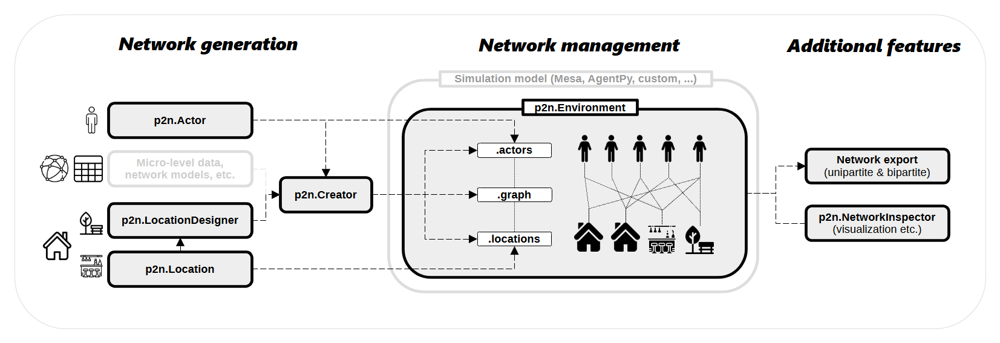
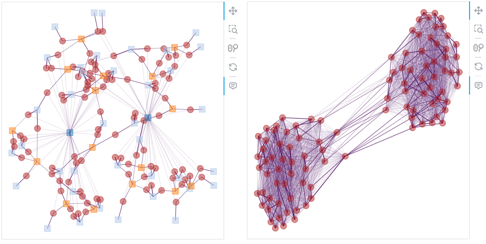

---
title: "Pop2net: Bipartite network generation for agent-based modeling"

tags:
  - Python
  - Agent-based modeling
  - Network generation
  - Bipartite networks
  - AgentPy
  - Mesa

authors:
  - name: Marius Kaffai
    orcid: 0000-0002-8619-3362
    equal-contrib: true
    affiliation: 1

  - name: Lukas Erhard
    orcid: 0000-0002-4977-2947
    equal-contrib: true
    affiliation: 1

affiliations:
 - name: University of Stuttgart, Germany
   index: 1

date: 27.01.2025

bibliography: paper.bib
---

# Summary

Agent-based modeling (ABM) is a scientific method used in fields such as social science, biology, and ecology to simulate interactions of autonomous agents and study the resulting emergent phenomena.
The relationships between agents, which structure the simulated interactions, are often represented by network graphs.
Since empirical data on networks is rare, most agent-based models rely on artificially generated networks [@amblard_which_2015].
Consequently, generating a valid network structure at the beginning of a simulation is critical.
Addtionally, accessing and modifying the network during the simulation are steps that must be managed in almost any agent-based model.

Pop2net is a Python package that combines many steps related to network generation and management for ABM using a bipartite approach.
Bipartite networks consist of two distinct types of entities where edges are only formed between entities of different types.
In Pop2net, relationships are represented as bipartite networks connecting *actors* and *locations*.
When two actors are linked to the same location, they are considered connected through that shared location.
In this way, locations serve as a contact layer between actors, representing places where interactions occur or contexts that facilitate actor connections.
The aim of Pop2net's bipartite approach to relations is to simplify the generation and management of network structures in ABM.


# Statement of Need
In Python, NetworkX [@hagberg_exploring_2008] provides extensive control over network structures and a wide range of ready-to-use network models.
However, NetworkX was not originally designed with ABM in mind, which can make managing networks or creating custom network structures within ABM frameworks cumbersome and inflexible.
While the built-in network models are powerful, they are often too abstract to directly support the specific needs of ABM applications.

ABM frameworks in Python—such as Mesa [@kazil_utilizing_2020, @hoeven_mesa_2025], AgentPy [@foramitti_agentpy_2021], and Melodie [@yu_melodie_2023]—offer improved data structures for representing and manipulating networks.
However, they still lack advanced tools for generating custom network topologies and provide only limited out-of-the-box support for bipartite graphs.

Pop2net aims to address this gap in the toolkit of agent-based modelers.
Building upon NetworkX, we provide an extensive tool designed to simplify and streamline the generation of (empirically calibrated) bipartite networks for further use with common ABM frameworks.
While Pop2net is implemented in Python, to our knowledge, no comparable software exists in other programming environments that offers the following features:

1. **Bringing bipartite networks to agent-based modeling.**
    Pop2net implements a bipartite approach to networks in ABM, which can simplify their creation and management by organizing relations through locations.
    Especially in models that simulate humans interacting in specific places or connected through shared contexts, organizing relationships through locations can be far more intuitive and easier to manage.
    While this approach is already common in epidemiological ABM (e.g., @kerr_covasim_2020, @vermeulen_social_2021, @kaffai_modeling_2021),
    Pop2net is the first software package to generalize the bipartite approach for ABM.
    In addition, networks generated by Pop2net—consisting of actors and locations—can be seamlessly integrated into Mesa and AgentPy.

2. **Generating scalable and modular networks.**
    Based on the bipartite approach, Pop2net offers an innovative way of creating networks programmatically and modularly.
    Users can quickly create complex networks based on different location definitions that are translated into network structures.
    Each location definition contains a set of rules for how agents connect, and can integrate empirical data as well as classic network models.

3. **Integrating micro-level data.**
    Pop2net is designed to integrate empirical micro-level data, e.g., from surveys, into the population and network generation processes.
    The empirical micro-level data can be used to generate a population of actors and then refer to the empirical attributes when determining the rules of how actors connect via location definitions.
    This enables users, especially those from the social sciences, to ground network generation in empirical data, even in the absence of detailed network data.


# Software structure

Pop2net's components can be categorized into three sectors.

1. **Basic elements for bipartite networks in ABM.**
    The first sector contains the three object classes—Environment, Actor, and Location—that must always be used to facilitate the bipartite network structure of Pop2net.
    The Environment class is Pop2net's main object that holds all entities and manages their relations.
    Central attributes of the Environment class are:
    * A NetworkX graph object that stores all actors, locations, and their relationships.
    * An actor list and a location list that provide convenient access to actor and location objects.
    * Various methods for managing tasks such as connecting actors and locations or exporting the network.

    Actors are the (inter)acting entities in the simulation—what is typically referred to as *agents* in ABM.
    However, since Pop2net also treats locations as agents, especially when integrated with frameworks like Mesa or AgentPy, we found it clearer to refer to the primary acting entities as *actors*.
    Locations represent the places or contexts in which actors interact.
    In Pop2net, every connection between actors must be mediated by a location.
    Both actors and locations provide several methods which help managing relations during simulations—for example, to retrieve all associated locations or actors, find neighboring actors within specific location types, or connect actors to one another through certain locations.


2. **Network generators.**
    The classes Creator and LocationDesigner are the tools in Pop2net that enable the user to generate custom (bipartite) networks in a modular and scalable way.
    By defining location types using the LocationDesigner, users can, for instance, quickly specify which agent should be connected to a certain location type, how many location instances should be created, whether locations are nested within other locations, or how strongly the connection between an actor and a location is weighted.
    Based on these definitions, the Creator class generates a bipartite network of actors and locations.
    The generated networks and their components can serve as the basis for simulation models, be integrated with Mesa and AgentPy, or be exported to NetworkX in both bipartite and unipartite formats.

    The Creator also provides convenient methods to generate actors and their attributes directly from empirical micro-level data, e.g., survey data.
    Those empirically created attributes support the creation of realistic network structures by including them in the location definitions, for instance, the age or the household of the actors.
    Location types can also incorporate network graphs based on empirical data or generated by NetworkX.

3. **Inspection tools.**
    The NetworkInspector class provides methods for quick network analysis, such as visualization and the calculation of network measures.


The diagram below visualizes Pop2net's structure and workflow:




# Example of network generation

The following example demonstrates how to generate a network with different location types and assign actors to these locations based on their attributes using Pop2net.
It involves loading micro-level data, defining rules for location creation and actor assignment, and finally sampling and connecting actors to locations accordingly.


```python
import pandas as pd
import pop2net as p2n

# load example micro-level data
df = pd.read_csv("example_data.csv")


# design city locations
class City(p2n.LocationDesigner):
    n_locations = 2 # set the number of cities to 2


# design households
class Household(p2n.LocationDesigner):
    def split(self, actor):
        """Create one household location for each household id."""
        return actor.household_id

    def weight(self, actor):
        """Set the weight between the actor and the location."""
        return 24 - actor.work_hours


# design work places
class Work(p2n.LocationDesigner):
    n_actors = 5 # set the number of actors per work location to 5

    def split(self, actor):
        """Create seperated work locations for each industry."""
        return actor.industry

    def weight(self, actor):
        """Set the weight between the actor and the location."""
        return actor.work_hours
    
    def filter(self, actor):
        """Only assign actors with more than 0 work hours to this location type."""
        return actor.work_hours > 0


# create pop2net's main objects
env = p2n.Environment()
creator = p2n.Creator(env)
inspector = p2n.NetworkInspector(env)

# create the agents and connect them
creator.create(
    df=df, # sample from this data to create the actors
    n_actors=100, # set the number of actors to 100
    sample_level="household_id", # sample whole households
    location_designers=[City, Household, Work], # connect the actors via cities, households and work places
    )

# plot bipartite and unipartite networks
inspector.plot_networks(location_color="label")
```



# Documentation

Pop2net offers user-friendly documentation, including API references and tutorials with interactive diagrams and example simulations.[^1]

[^1]: The tutorials are available at: [https://mariuzka.github.io/pop2net/index.html](https://mariuzka.github.io/pop2net/index.html)

# Acknowledgements

This work was funded by Deutsche Forschungsgemeinschaft (DFG, German Research Foundation) under Germany´s Excellence Strategy – EXC 2075 – 390740016.

We acknowledge the support of the Deutsche Forschungsgemeinschaft (DFG, German Research Foundation under the DFG reference number UP 31/1) for the Stuttgart Research Focus Interchange Forum for Reflecting on Intelligent Systems (IRIS).

We thank Maximilian Richter for his valuable contribution to the package.


# References
